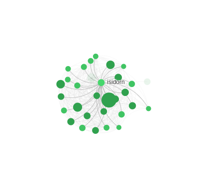

# Microtask 1

Download hypertrons-crx from Chrome Web Store. You can use this guide for reference. Then find those dashboards and write down:

- 5 relevant projects to [microsoft/vscode](https://github.com/microsoft/vscode)

  - [vscode](https://github.com/microsoft/vscode)
  - [Flutter](https://github.com/flutter/flutter)
  - [Azure Docs](https://github.com/MicrosoftDocs/azure-docs)
  - [Next Js](https://github.com/vercel/next.js)
  - [Rust](https://github.com/rust-lang/rust)

- The most active developer in [microsoft/vscode](https://github.com/microsoft/vscode)

  - [bypasero](https://github.com/bpasero)
  - [vscode triage bot](https://github.com/vscode-triage-bot)
  - [jrieken](https://github.com/jrieken)
  - [mjbvz](https://github.com/mjbvz)
  - [isidorn](https://github.com/isidorn)

- 5 relevant developers to [vscode-triage-bot](https://github.com/vscode-triage-bot)
  - [vscode-triage-bot](https://github.com/vscode-triage-bot)
  - [gjsjohnmurray](https://github.com/gjsjohnmurray)
  - [Tyriar](https://github.com/Tyriar)
  - [Connor4312](https://github.com/connor4312)
  - [mjbvz](https://github.com/mjbvz)

- The most active repositories for [vscode-triage-bot](https://github.com/vscode-triage-bot)
  - [vscode](https://github.com/microsoft/vscode)
  - [vscode-remote-release](https://github.com/microsoft/vscode-remote-release)
  - [chrmati/testissues](https://github.com/chrmarti/testissues)
  - [JacksonKearl/testissues](https://github.com/JacksonKearl/testissues)
