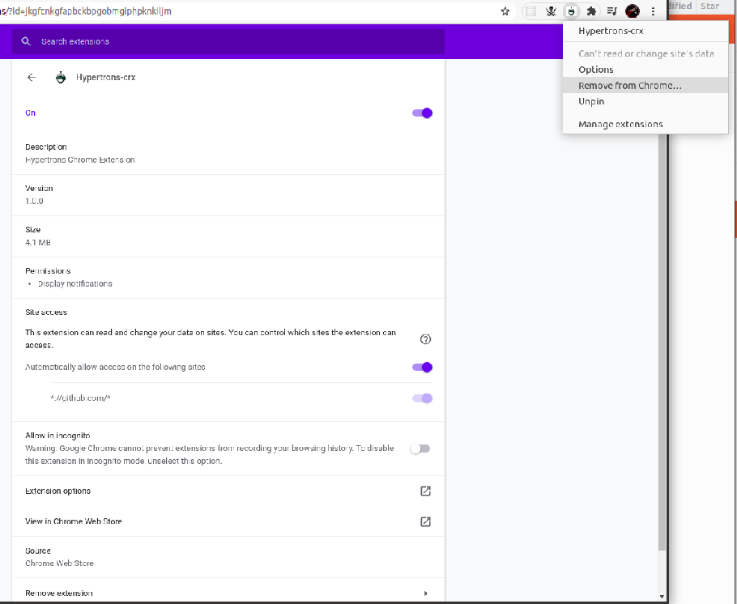
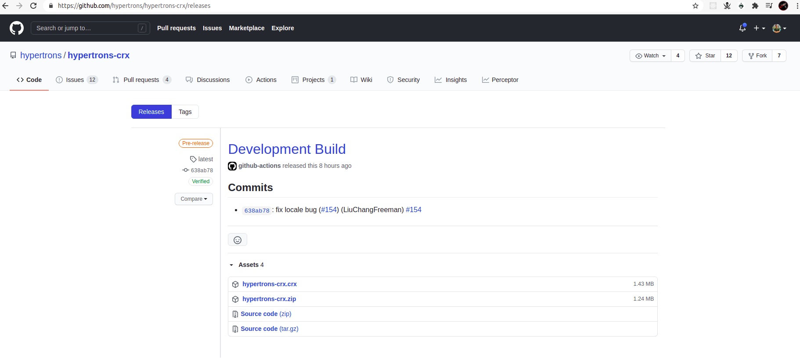
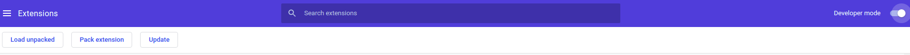

# Microtask 2

Remove your hypertrons-crx extension that downloaded from [Chrome Web Store] from Chrome (or Edge). And then re-install it from our release.

Steps

- Uninstall the installed plugin(hypertrons-crx)
  
- After successfully uninstalling the plugin, go to [Release section](https://github.com/hypertrons/hypertrons-crx/releases) to download the source file.
  

> Make sure you download hypertrons-crx.crx

- Turn on the Developer mode on by typing [chrome://extensions/](chrome://extensions/) in the url.
  
- Now upload the downloaded file via load unpacked
- After successful installation, make sure you set the github token.
