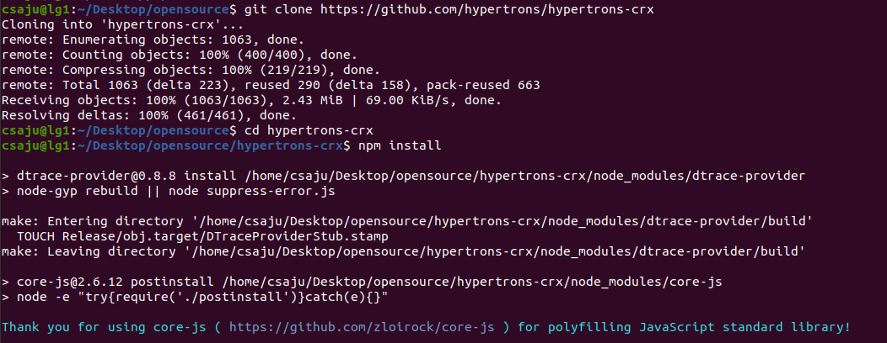

# Microtask 3

Set up hypertrons-crxin your machine.

Steps:

- Copy out the following snippets in terminal.

```git
git clone https://github.com/hypertrons/hypertrons-crx
cd hypertrons-crx
npm install
npm run watch
npm run web-ext
```



> Be patient, as the installation process takes more time for a fresh install of packages used by the hypertrons-crx.
